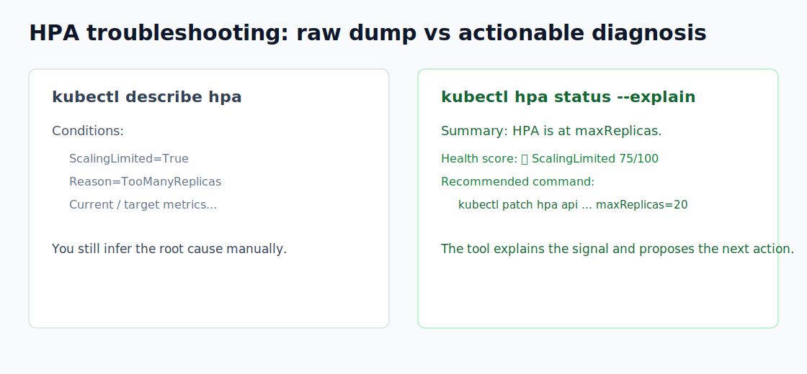

# kubectl-hpa-status

[](https://github.com/mattsu2020/kubectl-hpa-status/actions/workflows/ci.yml)
[](https://github.com/mattsu2020/kubectl-hpa-status/actions/workflows/codeql.yml)
[](https://github.com/mattsu2020/kubectl-hpa-status/actions/workflows/release.yml)
[](https://pkg.go.dev/github.com/mattsu2020/kubectl-hpa-status)
[](https://goreportcard.com/report/github.com/mattsu2020/kubectl-hpa-status)
[](https://github.com/mattsu2020/kubectl-hpa-status/stargazers)
[](https://github.com/mattsu2020/kubectl-hpa-status/releases)
[](https://goreleaser.com/)
[](https://golangci-lint.run/)
[](https://krew.sigs.k8s.io/plugins/)
[](https://kubernetes.io/docs/tasks/run-application/horizontal-pod-autoscale/)
[](https://codecov.io/gh/mattsu2020/kubectl-hpa-status)
[](LICENSE)


既存の Kubernetes API シグナルを活用し、詳細なスケーリング分析とともに HorizontalPodAutoscaler (HPA) の状態を調査するための kubectl プラグインです。

English README: [README.md](README.md)

このツールは、HPA運用でよくある3つの疑問にすばやく答えます。

- このHPAは正常か、上限に張り付いているか、安定化中か、メトリクス取得に失敗しているか。
- どのConditionやメトリクスが現在の挙動を説明しているか。
- 次に実行すべきコマンドは何か、安全にdry-run検証できるか。

リポジトリ名とバイナリ名は `kubectl-hpa-status` です。`kubehpa_cli` は初期開発時の作業ディレクトリ名/愛称であり、リリース成果物、Go module path、インストールコマンドでは使いません。

## デモ

- スクリーンショット: [images/demo.png](images/demo.png)
- 比較画像: [images/describe-vs-hpa-status.svg](images/describe-vs-hpa-status.svg)
- status explainデモ: [docs/status-explain.cast](docs/status-explain.cast)
- wide listデモ: [docs/list-wide.cast](docs/list-wide.cast)
- watchデモ: [docs/watch.cast](docs/watch.cast)
- `--explain` から `--suggest`、`--fix --apply` までの流れ: [docs/fix-flow.cast](docs/fix-flow.cast)



| ワークフロー | 画像 |
| --- | --- |
| `status --explain` | [status-explain.svg](images/status-explain.svg) |
| `list -A --wide --problem` | [list-wide.svg](images/list-wide.svg) |
| `watch --interval 5s` | [watch-mode.svg](images/watch-mode.svg) |
| `--suggest` dry-runコマンド | [suggest-dry-run.svg](images/suggest-dry-run.svg) |
| `--fix --apply` 差分確認 | [apply-diff.svg](images/apply-diff.svg) |
| 日本語ラベル | [ja-output.svg](images/ja-output.svg) |
| `scan` クラスタ診断 | [scan-output.svg](images/scan-output.svg) |
| JSON出力 | [json-output.svg](images/json-output.svg) |
| メトリクス取得失敗 | [metrics-failure.svg](images/metrics-failure.svg) |
| スケールダウン安定化 | [stabilized-output.svg](images/stabilized-output.svg) |
| 複数メトリクス推定 | [multi-metric-output.svg](images/multi-metric-output.svg) |

Social preview画像の元ファイル: [images/social-preview.svg](images/social-preview.svg)

### なぜ `kubectl-hpa-status` を使うべきなのか？

| 機能 | `kubectl describe hpa` | `kubectl hpa status` (本プラグイン) |
| --- | --- | --- |
| **焦点** | 生のステータスとスペックのダンプ | 多角的な診断と推奨アクションの提示 |
| **スケーリング要約** | 標準的なK8sのConditionテキスト | 明確な運用方針の要約表示 |
| **制限の検出** | 生の最小/最大レプリカ数の表示 | `maxReplicas` に達した際の上限キャップの自動説明 |
| **複数メトリクス診断** | 各ターゲットを個別に列挙 | 最も影響の大きいメトリクスを推測してハイライト |
| **安定化ウィンドウの警告** | 明示的には追跡されない | アクティブなスケールダウン安定化時間を検知し待機時間を推奨 |
| **Watchモード** | 外部の `watch` コマンドが必要（差分表示なし） | 前回の状態との差分をハイライトする組込Watch |
| **推奨ガイド** | なし | *なぜ* その状態なのかを説明し、設定の修正案を提案 |

## クイックスタート

```sh
kubectl hpa status <hpa-name> -n <namespace>
kubectl hpa status <hpa-name> --explain
kubectl hpa status <hpa-name> --suggest
kubectl hpa status <hpa-name> --fix --apply
kubectl hpa status <hpa-name> --fix --apply --dry-run=false
kubectl hpa status <hpa-name> --lang=ja
kubectl hpa status scan
kubectl hpa status list -A --problem
kubectl hpa status list -A --wide --sort-by=desired --filter=scaling-limited
kubectl hpa status ls -A -o json
kubectl hpa status <hpa-name> --watch --timeout=2m --until-condition=scaling-limited
kubectl hpa status <hpa-name> -o 'jsonpath={.analysis.summary}'
```

出力の読み方:

- `Summary` (要約) は、HPAステータスから導出された視覚的な状態です。
- `Recommended actions` (推奨アクション) は、ConditionやBehavior設定に基づいた運用上のヒントです。
- `Interpretation` (解釈) は診断上の推論であり、コントローラーの非公開な決定履歴そのものではありません。
- `confidence: high` (確信度: 高) は明示的なステータスフィールドに基づいていることを示し、`confidence: medium` (確信度: 中) はステータスと説明が一致しているものの、API自体が内部の詳細な理由を開示していないことを示します。

よく見るべきシグナル:

- `ScalingActive=False`: metrics-server、custom metrics adapter、external metrics adapterを確認します。
- `ScalingLimited=True`: `minReplicas`、`maxReplicas`、target utilizationを確認します。
- `ScaleDownStabilized`: `spec.behavior.scaleDown.stabilizationWindowSeconds` と安定化ウィンドウを確認します。
- 出力が古い場合: `status.observedGeneration` と `metadata.generation` を比較します。

インストール直後のhelp出力例:

```text
Inspect HorizontalPodAutoscaler status

Usage:
  kubectl-hpa-status [flags]
  kubectl-hpa-status [command]

Available Commands:
  analyze     Analyze one HPA using visible Kubernetes API signals
  completion  Generate shell completion
  list        List HPAs and highlight visible issues
  scan        Scan all namespaces for HPAs with visible problems
  status      Show concise status for one HPA
  watch       Watch one HPA status

Common flags include -n/--namespace, -A/--all-namespaces, -o/--output,
--events, --explain, --watch, --interval, --timeout, and --until-condition.
```

## インストール

### Krew (推奨)

```sh
kubectl krew install hpa-status
kubectl hpa status <hpa-name> -n <namespace>
kubectl hpa status list -A --wide
kubectl hpa status <hpa-name> --suggest
```

Krewではプラグイン名は `hpa-status` として入ります。kubectlはハイフンを含む
プラグインを `kubectl hpa_status` として検出できます。
**このREADMEでは、kubectlのnested plugin discoveryが対応している環境向けに
`kubectl hpa status` を推奨形として書いています。動かない場合は
`kubectl hpa_status status <hpa-name>` または
`kubectl-hpa-status status <hpa-name>` を使ってください。**

### Homebrew

```sh
brew install --cask mattsu2020/kubectl-hpa-status/kubectl-hpa-status
kubectl-hpa-status list -A --wide
```

### 手動インストール

```sh
go mod tidy
go build -o kubectl-hpa-status .
chmod +x ./kubectl-hpa-status
sudo mv ./kubectl-hpa-status /usr/local/bin/
kubectl hpa status <hpa-name> -n <namespace>
```

読み取り専用RBACと、`--apply --dry-run=false` 用のpatch権限例は
[docs/rbac.yaml](docs/rbac.yaml) を参照してください。

Go module path、GitHubリポジトリ、リリースメタデータ、ユーザー向けバイナリ名は
すべて `github.com/mattsu2020/kubectl-hpa-status` / `kubectl-hpa-status`
に統一されています。

## サンプル

実用的なサンプルマニフェストは [examples/](examples/) にあります。

| 例 | 内容 |
| --- | --- |
| [cpu-memory-hpa.yaml](examples/cpu-memory-hpa.yaml) | CPU + Memoryの複数メトリクスHPA |
| [behavior-hpa.yaml](examples/behavior-hpa.yaml) | scaleUp/scaleDownポリシーとstabilization window |
| [custom-metrics-hpa.yaml](examples/custom-metrics-hpa.yaml) | custom metrics adapter向けのObject metric例 |
| [keda-style-hpa.yaml](examples/keda-style-hpa.yaml) | KEDA風ラベルとExternal metricを持つHPA |

```sh
kubectl apply -f examples/cpu-memory-hpa.yaml
kubectl hpa status web-multi -n hpa-status-examples --explain --suggest
kubectl hpa status list -n hpa-status-examples --wide
kubectl delete namespace hpa-status-examples
```

## 使い方

```sh
kubectl hpa status <hpa-name> [-n namespace] [--context context] [--events=false]
kubectl hpa status <hpa-name> --watch --interval 5s
kubectl hpa status <hpa-name> --watch --timeout 2m --until-condition scaling-limited
kubectl hpa status analyze <hpa-name>
kubectl hpa status list [-A] [--sort-by desired] [--filter scaling-limited]
kubectl hpa status list -A --problem
kubectl hpa status scan
kubectl hpa status ls [-A] --wide
kubectl hpa status watch <hpa-name> --interval 5s
```

直接バイナリとしても実行できます。

```sh
kubectl-hpa-status analyze <hpa-name> -n <namespace>
kubectl-hpa-status status <hpa-name> -n <namespace>
kubectl-hpa-status status <hpa-name> --suggest
kubectl-hpa-status status <hpa-name> --fix --apply
kubectl-hpa-status status <hpa-name> --fix --apply --dry-run=false
kubectl-hpa-status scan
kubectl-hpa-status list -A
kubectl-hpa-status completion zsh
```

主なフラグ:

- `-n, --namespace`: namespace
- `-A, --all-namespaces`: 全namespaceのHPAを一覧
- `--context`, `--kubeconfig`, `--cluster`: kubeconfig選択
- `-o table|wide|json|yaml|jsonpath=...|template=...`: 出力形式
- `--wide`: table出力でtarget、min、maxを表示
- `--sort-by namespace|name|current|desired|health|health-score|issue`: `list` のソート
- `--filter all|ok|error|limited|scaling-limited|issue`: `list` のフィルタ
- `--health-score <threshold>`: 正の閾値を指定し、health scoreがその値以下のHPAだけ表示
- `--color auto|always|never`: table出力の色
- `--interpret`: compact statusに診断解釈を含める
- `--explain`: 詳細な解釈と推奨アクションを含める
- `--suggest`: 安全に見えるHPA spec修正案を `kubectl patch` として表示
- `--fix`: より強い修正計画と適用可能なpatchを表示
- `--apply`: デフォルトではserver-side dry-runでHPA patchを検証
- `--dry-run=false`: `--apply` と併用したときのみ永続変更。`-y` なしでは確認プロンプトあり
- `--problem`: `list` で問題が見えるHPAだけ表示
- `--lang=ja` または `-o ja`: 日本語ラベルで表示
- `--no-interpret`: 解釈を省き、ステータス由来のデータのみ表示
- `--events=false`: 最近のEventsを省略
- `--events=3`: 最新3件のHPA Eventsを表示
- `--watch --interval 5s`: メインコマンドから単一HPAを更新表示
- `--timeout 2m`: watchを指定時間で停止
- `--until-condition scaling-limited`: 指定conditionが出たらwatch停止
- `--version`: バージョンを表示

対応Kubernetesバージョン:

- Runtime target: `autoscaling/v2` `HorizontalPodAutoscaler` を提供するクラスタ
- 検証済みクラスタ: Kubernetes v1.35.0 + metrics-server v0.8.1
- Client libraries: `k8s.io/client-go` / `k8s.io/api` v0.35.0

このプラグインが読む情報:

- `autoscaling/v2` `HorizontalPodAutoscaler`
- `status.currentReplicas`
- `status.desiredReplicas`
- `status.currentMetrics`
- `status.conditions`
- `status.observedGeneration` が存在する場合
- `spec.behavior` が存在する場合
- 直近のHPA Events

HPA controllerの内部意思決定ロジックを再実装するものではありません。

## 開発

```sh
make build
make test
make coverage
make lint
make release-check
```

設計・セキュリティ・コントリビューション方針:

- [ARCHITECTURE.md](ARCHITECTURE.md)
- [SECURITY.md](SECURITY.md)
- [CONTRIBUTING.md](CONTRIBUTING.md)

kindを使ったE2Eテスト:

```sh
kind create cluster --name hpa-status-dev
make e2e
kind delete cluster --name hpa-status-dev
```

## よくあるトラブルパターン

| 症状 | コマンド | 主なシグナル | 次の一手 |
| --- | --- | --- | --- |
| メトリクスが取れずスケールしない | `kubectl hpa status <name> --explain` | `ScalingActive=False`, Events | metrics-server または custom/external metrics adapter を確認 |
| レプリカ数が上限に張り付く | `kubectl hpa status <name> --suggest` | `ScalingLimited=True`, `desiredReplicas == maxReplicas` | 容量を確認し、提案されたmaxReplicasパッチをdry-run検証 |
| スケールダウンが遅い | `kubectl hpa status <name> --explain` | `ScaleDownStabilized`, `spec.behavior.scaleDown` | stabilization windowを待つか調整 |
| クラスタ全体を棚卸ししたい | `kubectl hpa status scan` | health score, issue, conditions | `ERROR` から優先して確認 |

## 互換性マトリクス

| 環境 | 状態 |
| --- | --- |
| HPA API `autoscaling/v2` | 必須 |
| Kubernetes v1.35.0 | 検証済み |
| kind上のmetrics-server v0.8.1 | 検証済み |
| custom/external metrics adapters | HPA statusに見える範囲で対応 |
| KEDA管理のHPA | HPAオブジェクトとして診断可能。KEDA固有分析は将来対応 |

## 検証済み環境

- kind: v0.31.0
- kind node image: `kindest/node:v1.35.0`
- Kubernetes server: v1.35.0
- kubectl: v1.36.1
- metrics-server: v0.8.1
- HPA API: `autoscaling/v2`

metrics-serverはupstream release manifestにkind向けの
`--kubelet-insecure-tls` オプションを加えて検証しています。

## 安全な修正フロー

`--suggest` / `--fix --apply` は安全側に倒しています。

1. `--suggest` は `--dry-run=server` 付きの `kubectl patch` を表示します。
2. `--fix --apply` もデフォルトではserver-side dry-runで、適用前に差分を表示します。
3. 永続的に変更するには `--dry-run=false` が明示的に必要です。
4. maxReplicas引き上げ提案には、容量・quota・コスト・下流依存の確認を促す警告を出します。
5. プレビューでは「メトリクスが高いままなら即時ScaleUpが起き得る」など、期待される効果も示します。

dry-runモードの違い:

- `--dry-run=server`: Kubernetes API serverにpatchを送り、admissionやdefaulting込みで検証します。ただし永続化しません。
- `--dry-run=client`: kubectlローカル側だけで検証するため、server-side admissionの挙動を見逃す可能性があります。
- `kubectl-hpa-status --apply` はデフォルトでserver-side dry-runです。永続変更には `--dry-run=false` が必要です。

## Limitations

- Kubernetes HPA APIは、controller内部の正確なscaling decision traceを公開していません。
- 複数メトリクス時の「勝者」判定は、見えている `currentMetrics` と `spec.metrics` からのbest-effort推定です。
- tolerance、missing metricsの保守的処理、not-ready pods、stabilizationの内部recommendation historyはHPA statusだけでは完全には見えません。
- Eventsは直近の文脈として有用ですが、永続的な構造化decision logとしては扱いません。

## CI/CD

| Workflow | 目的 |
| --- | --- |
| [ci.yml](.github/workflows/ci.yml) | `go test`、coverage、govulncheck、gosec、golangci-lint、kind E2E |
| [codeql.yml](.github/workflows/codeql.yml) | CodeQL静的解析 |
| [release.yml](.github/workflows/release.yml) | GoReleaserによるバイナリ、SBOM、Homebrew Cask Tap更新、Krew release bot |

CI実行時にcoverageをCodecovへアップロードします。リリース時のHomebrew更新は
専用Tap [mattsu2020/homebrew-kubectl-hpa-status](https://github.com/mattsu2020/homebrew-kubectl-hpa-status)
を使います。

## Validation matrix

| ケース | 既存シグナルで説明可能か | 使用するシグナル | 残る曖昧さ |
| --- | --- | --- | --- |
| CPUがtargetを超えScaleUp | だいたい可能 | `currentMetrics`, `desiredReplicas`, Events | 低 |
| CPUがtarget未満でScaleDown | だいたい可能 | `currentMetrics`, `desiredReplicas`, Events | 低 |
| `maxReplicas` に制限 | 可能 | `ScalingLimited`, `maxReplicas` | 低 |
| メトリクス取得失敗 | 可能 | `ScalingActive=False`, Events | 低 |
| 複数メトリクスの最終勝者 | 一部難しい | `currentMetrics`, `spec.metrics` | 中 |
| ScaleDown stabilization | 一部可能 | `AbleToScale`, condition reason, Events | 中 |
| toleranceによるno-scale | 難しい | `currentMetrics`, `desiredReplicas` | 中から高 |
| missing metrics / not-ready podsの影響 | 難しい | 現状のstatusでは不足 | 高 |

Eventsは直近の診断コンテキストとして有用ですが、このPOCでは安定した意思決定記録としては扱いません。

## 出力例

List view:

```text
NAMESPACE            NAME                             CURRENT  DESIRED  HEALTH              SCORE    ISSUE                            SUMMARY
default              web                              3        5        🟢 Healthy          100                                       HPA currently wants to scale up.
default              api                              2        2        🔴 ERROR            55       ERROR: FailedGetResourceMetric   HPA cannot currently compute a scaling recommendation from metrics.
```

複数メトリクスHPA:

```text
HPA default/web-multi
Target: Deployment/web-multi
Replicas: current=5 desired=5 min=2 max=5
Health score: 🔴 ScalingLimited 75/100
Summary: HPA is at maxReplicas.

Metrics:
  - Resource cpu current=0% target=80% note="current value is below target"
  - Resource memory current=68% target=50% note="current value is above target"

Recommended actions:
  - HPA is capped at maxReplicas; raise maxReplicas or reduce load/target utilization if more capacity is expected.

Recommended commands:
  - Raise maxReplicas: The HPA is capped at maxReplicas=5. Raising it to 10 allows the controller to add capacity if metrics still require it. (risk: medium)
    $ kubectl patch hpa web-multi -n default --type=merge -p '{"spec":{"maxReplicas":10}}'

Interpretation:
  - [confidence: high] ScalingLimited reports that the visible desired replica count is constrained by maxReplicas.
  - [confidence: medium] Among visible resource utilization metrics, memory has the largest distance from target (ratio 1.360).
  - [confidence: high] This is only an impact estimate; the API does not expose per-metric replica recommendations or the final metric winner.
```

## Findings

既存のHPAシグナルだけでも、以下はかなり説明できます。

- `ScalingActive=False`、condition reason、直近Eventsによるメトリクス取得失敗
- `ScalingLimited=True`、condition reason、`desiredReplicas == maxReplicas` による上限到達
- `currentReplicas` と `desiredReplicas` による見えているScaleUp / ScaleDown方向
- `ScaleDownStabilized` のようなcondition reasonで表面化しているScaleDown stabilization

一方で、現在のHPA statusだけでは安定して断定しづらいものもあります。

- 複数メトリクスHPAで、最終的にどのmetricが推奨値を決めたか
- no-scaleがtolerance由来なのか、roundingや保守的なmetric処理由来なのか
- missing metricsやnot-ready podsが内部推奨値へどう影響したか
- stabilizationに使われた内部recommendation history

## Known Gaps

このプラグインは、HPA status、metrics、conditions、eventsから推論できることを表示します。
controller内部の中間計算や非公開の意思決定履歴を知っているわけではありません。
解釈行にはconfidenceを付け、直接観測できる事実と弱い推論を区別します。

## ロードマップ
- [x] **インテグレーションテスト:** CI検証用の `kind` ベースE2Eテスト。
- [x] **デモのビジュアル化:** ドキュメントへのスクリーンショットの追加。
- [x] **Homebrew配布:** GoReleaserで専用TapのHomebrew CaskとSBOMを生成。
- [ ] **インタラクティブTUIモニタ:** watchモードをリッチなダッシュボードへ強化。
- [x] **バッチ分析機能:** `scan` / `list -A --problem` で問題のあるHPAを一括診断。
- [x] **Suggest/Fix機能:** `--suggest` / `--fix --apply` により、具体的なパッチ案と適用フローを表示。
- [ ] **KEDA / Custom Metrics深掘り:** HPA statusに見える範囲を超えたadapter固有の文脈を追加。

## ライセンス

Apache-2.0
